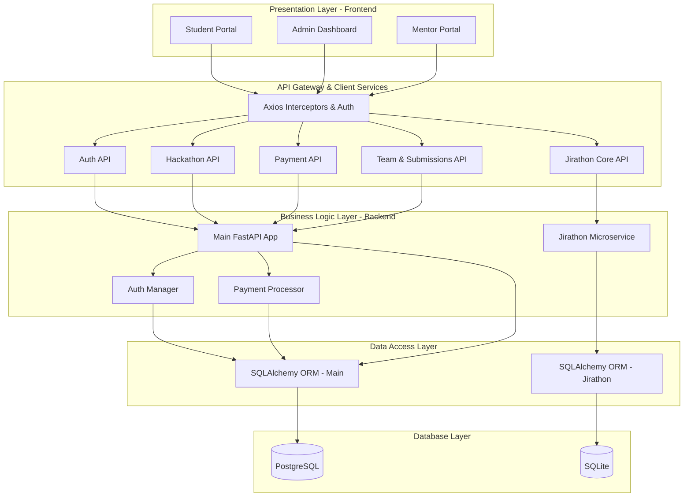

# HackFusion Platform Architecture

## Layered Architecture Diagram

## Detailed API Endpoints & Layer Mapping

### 1. Presentation Layer (Frontend Screens)
- **Student Dashboard**: Displays available hackathons and user profile.
- **Hackathon Details Modal**: Shows hackathon info, problem statements, and registration status.
- **Team Management**: Interface to invite members, accept/reject invitations.
- **Admin Portal**: User management, hackathon creation, monitoring.
- **Jirathon Challenge**: Capture flags/keys for interactive coding challenges.

### 2. API Layer & BFF (`frontend/src/services/api.ts`)
- **Authentication**: Intercepts requests to inject `Bearer` token. Handles 401 logouts globally.
- **Error Handling**: Standardized parsing of backend errors into user-friendly messages.

### 3. Business Logic & API Endpoints (FastAPI)

#### Auth & User API
- `POST /auth/register`: Create new user
- `POST /auth/login`: Authenticate and receive JWT
- `GET /users/me`: Fetch current user profile
- `PATCH /users/me`: Update profile details

#### Hackathon API
- `GET /hackathons`: List all hackathons
- `GET /hackathons/{id}`: Detailed view
- `POST /hackathons`: (Admin) Create a hackathon
- `POST /hackathons/{id}/register`: Register for a free hackathon

#### Payment & Registration API
- `POST /payments/initiate`: Generate payment hash and init PayU transaction
- `POST /payments/simulate`: Simulate payment success/failure
- `POST /payments/verify`: Confirm transaction

#### Team & Submission API
- `POST /teams`: Create a team
- `POST /teams/{id}/invite`: Invite user
- `POST /submissions`: Submit project (repo/demo link)
- `GET /submissions/leaderboard/{id}`: Hackathon leaderboard

#### Jirathon API (Microservice)
- `POST /submit`: Validate project keys and progress stage
- `GET /progress/{project_id}/{team_name}`: Retrieve current stage
- `GET /leaderboard/{project_id}`: Jirathon-specific leaderboard

### 4. Screen Interaction Flow tied to Layers

**Flow Example: Hackathon Registration & Payment**
1. **Presentation Layer**: User clicks "Register" on Hackathon Details screen.
2. **API Layer**: `paymentAPI.initiatePayment` is called.
3. **Business Layer**: Backend generates a unique transaction ID and computes GST/Total amounts.
4. **Presentation Layer**: UI redirects to PayU / Mock Payment Gateway.
5. **Business Layer**: Webhook or simulate callback triggers `POST /payments/verify`.
6. **Data Access Layer**: Updates the `Registration` record status to 'completed'.
7. **Database Layer**: Commits transaction to PostgreSQL.
8. **Presentation Layer**: UI polls or receives success, navigating user to the "My Registrations" dashboard.

**Flow Example: Jirathon Challenge Key Submission**
1. **Presentation Layer**: User enters a discovered key in the Jirathon widget.
2. **API Layer**: Calls `POST /submit` with `team_name`, `project_id`, and `key`.
3. **Business Layer (Jirathon Service)**: Validates key against `PROJECT_KEYS` dictionary.
4. **Data Access Layer**: Fetches or creates `TeamProgress` record, increments `stage` and `score`.
5. **Database Layer**: Updates `sqlite` record.
6. **Presentation Layer**: Notifies user "Stage Cleared!" and updates the visible score/stage.
