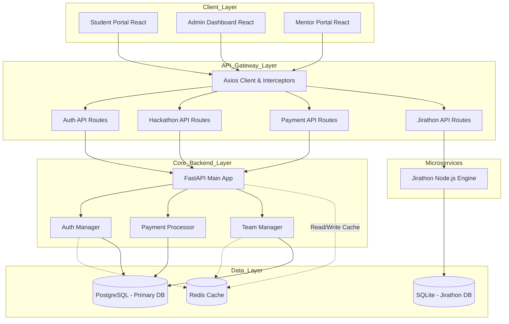
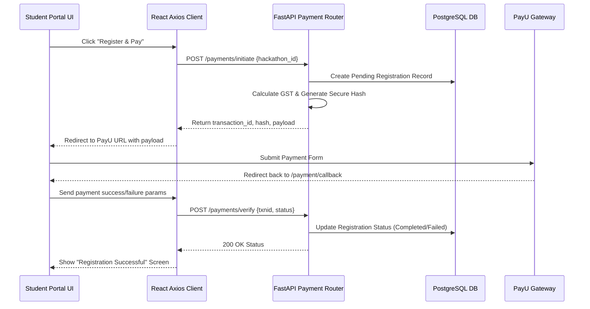
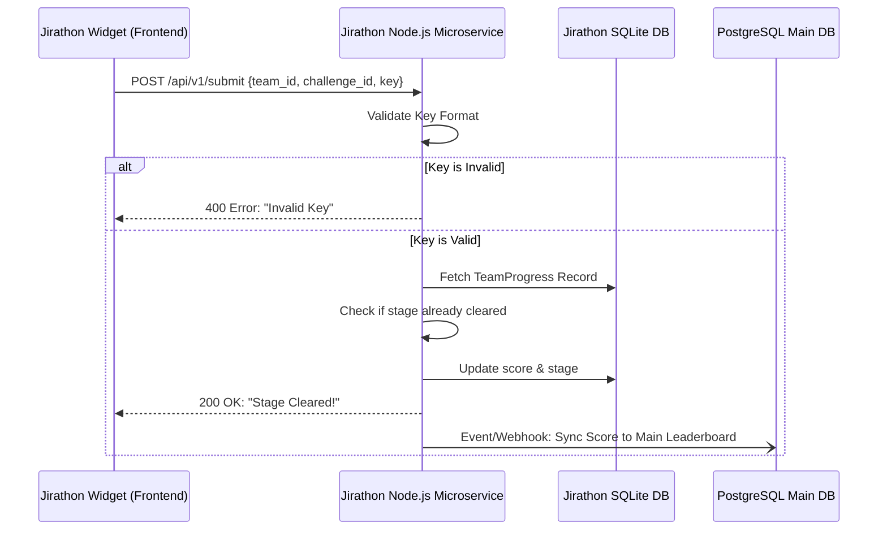
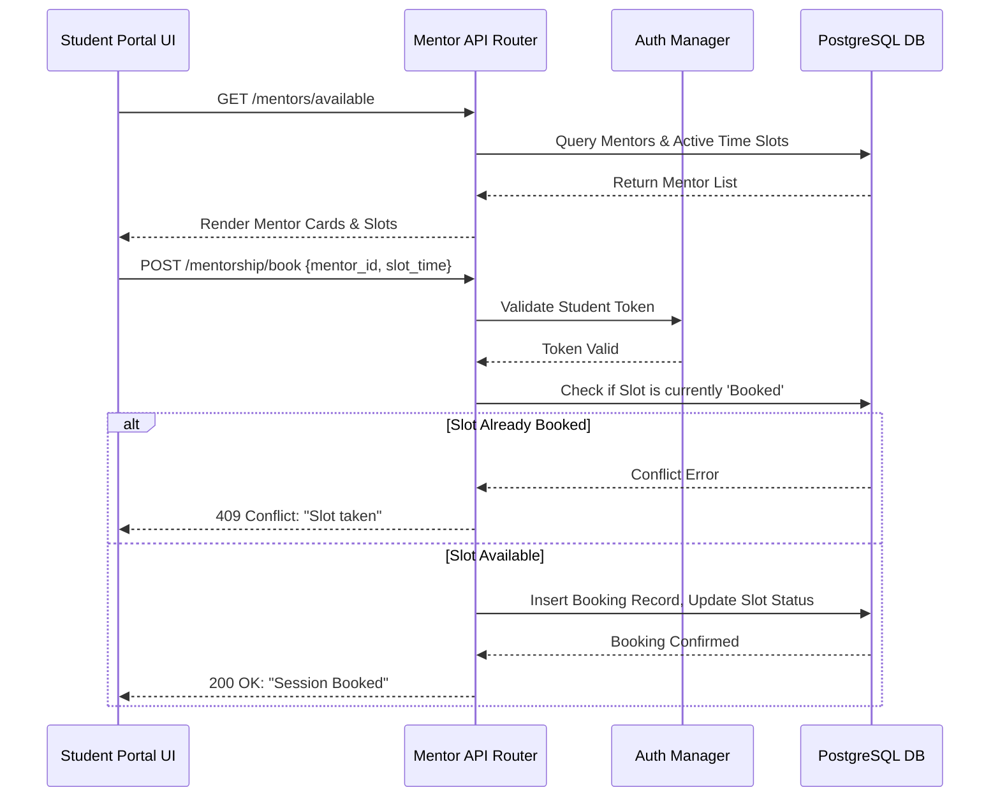
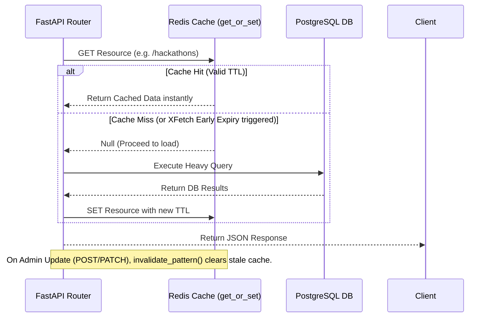

# HackFusion End-to-End Architecture & Resource Workflows

This document outlines the detailed end-to-end architecture, resource-level interactions, and core workflows of the HackFusion platform.

## 1. High-Level System Architecture

The system is broken down into modular layers ensuring separation of concerns, scalability, and ease of maintenance.

---

## 2. Resource-Level Workflows

The following diagrams illustrate how specific resources interact across the stack during critical user journeys.

### 2.1 Registration & Payment Workflow

This workflow handles a student registering for a paid hackathon, generating a payment hash, communicating with PayU, and finalizing the registration record.

### 2.2 Jirathon Coding Challenge Workflow

This workflow handles the decentralized Microservice architecture for the anti-LLM coding challenges, utilizing an isolated Node.js environment to validate flags.

### 2.3 Mentorship Booking Workflow

The mentorship ecosystem relies on checking availability constraints and updating the calendar without double-booking.

### 2.4 Cache-Aside & Stampede Protection Workflow

To ensure performance during high-traffic events (e.g., Hackathon launches), the platform heavily uses an async Redis cache. It implements a probabilistic early-expiry model to prevent cache stampedes.

---

## 3. Data Entities & Resource Mapping

### Primary Domain Models (PostgreSQL)

*   **Users**: Unified table for `Admin`, `Student`, and `Mentor` roles. Differentiated by `role` enum.
*   **Hackathons**: Contains configuration, dates, pricing, and visibility toggles.
*   **Teams**: Relates `Users` (members) to a specific `Hackathon`.
*   **Registrations**: Tracks payment intent, `transaction_id`, status, and final amount paid.
*   **MentorshipSessions**: Maps a `Student` to a `Mentor` at a specific timestamp.

### Microservice Domain Models (SQLite - Jirathon)

*   **TeamProgress**: Decoupled from the main database to allow high-throughput I/O during active CTF/Challenge phases without degrading core API performance. Tracks `stage_id` and `current_score`.
